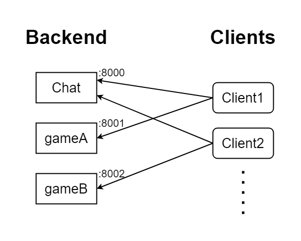

# socket.io-distributor

Transparent load leveling for socket.io. Transfers events via redis like [socket.io-redis](https://github.com/socketio/socket.io-redis) but allows two-way communication.

Install via npm: [socket.io-distributor](https://www.npmjs.com/package/socket.io-distributor).

Source code on GitHub: [phiresky/socket.io-distributor](https://github.com/phiresky/socket.io-distributor)

Works great with [typed-socket.io](https://github.com/phiresky/typed-socket.io).


## Motivation

Say you have multiple socket.io backends, for example a chat and two games.

Client1 wants to connect the chat and gameA, and Client2 wants to connect to the chat and gameB.

Without this library, both clients need to open two connections (to each backend):




With this library, each client only connects to one distributor (it doesn't matter which), and that in turn connects to the wanted backends via redis using socket.io namespaces:


Now, when a backend emits an event to everyone or to everyone in [a room](https://socket.io/docs/rooms-and-namespaces/#rooms), it only has to send a single event instead of n events (one for each client). When a server sends an event to a single client, it only goes to the correct distributor, so each distributor has the load of only its own clients.


You can also add a reverse proxy like nginx before the distributors, that then chooses a random distributor using [multiple upstreams](https://nginx.org/en/docs/http/ngx_http_upstream_module.html). That way everything will look from the client side like a single socket.io server with multiple namespaces.

## Usage


On your backend, instead of doing this:

```ts
import socketio from "socket.io";
import http from "http";
const server = http.createServer();
server.listen(8000);
const io = io(server).of("/chat");
```

Do this:

```ts
import { indirectSocketViaRedis } from "socket.io-distributor/backend";

const io = indirectSocketViaRedis<MyServerDefinition, "/chat">({
    namespace: "/chat",
    redis: { uri: "redis://localhost:6379" },
});
```

The `io` object will work basically the same as before.

Then you start a few distributor processes that look like this:

```ts
const slaveId = +process.argv[2];
const server = http.createServer();
server.listen(8000 + slaveId);
const worker = new Worker<MyServerDefinition>({
    server,
    slaveId,
    namespaces: ["/chat" /*...*/],
    redis: { uri: "redis://localhost:6379" },
});
```

Now clients can connect to any of http://localhost:8001, http://localhost:8002, etc, and they will be able to send and receive messages from the backend.
